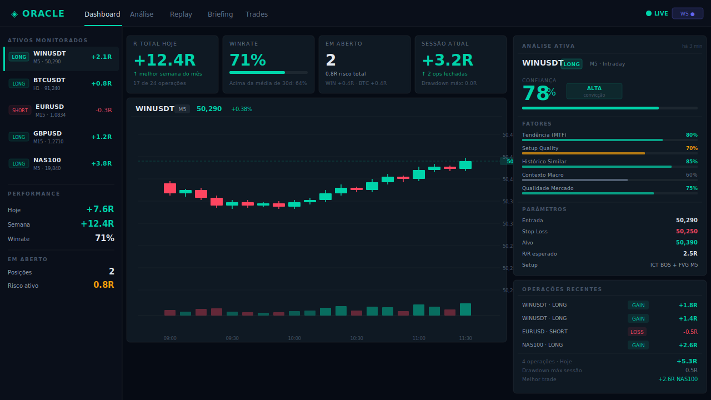
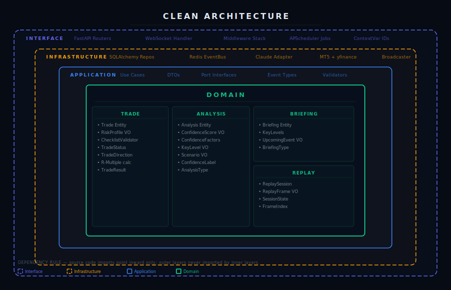
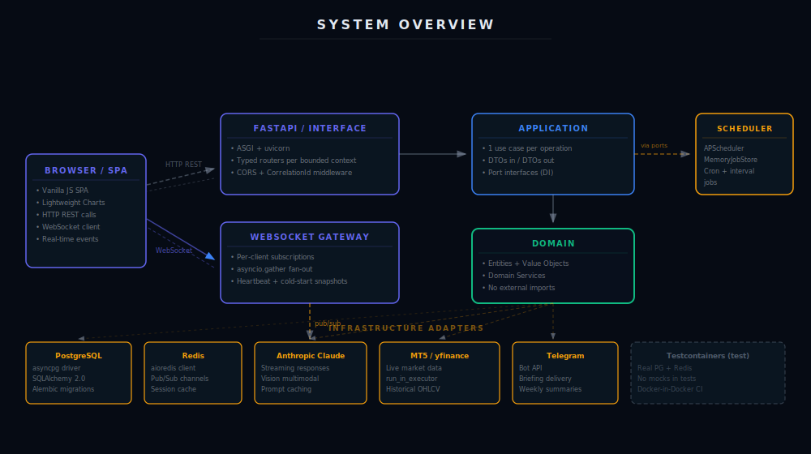
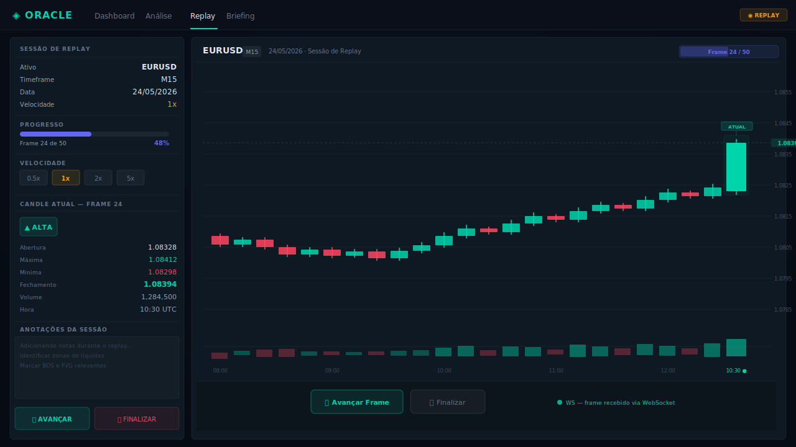

# Oracle Trader Assist

[](https://python.org)
[](https://fastapi.tiangolo.com)
[](https://postgresql.org)
[](https://redis.io)
[](https://developer.mozilla.org/en-US/docs/Web/API/WebSocket)
[](LICENSE)

> Intelligent real-time trading assistant — AI-powered analysis, market replay, and automated briefings, built on Clean Architecture and async Python.



---

## Overview

Oracle Trader Assist is a production-grade intraday workflow tool that integrates multi-modal AI analysis, real-time market data, and trade lifecycle management into a single interface.

The system is built around a strict Clean Architecture: the domain layer has zero framework dependencies, all use cases are independently testable, and infrastructure adapters are fully swappable behind typed interfaces. Real-time updates flow through a WebSocket event bus that decouples domain events from transport.

The frontend is intentionally zero-dependency — vanilla JavaScript talking to the backend over HTTP and WebSocket, with [Lightweight Charts v5](https://tradingview.github.io/lightweight-charts/) for OHLCV rendering. No build step, no bundler, no framework overhead.

**Modules:**

| Module | Description |
|--------|-------------|
| **Analysis** | Multi-modal AI analysis (vision + text) with streaming responses and confidence scoring |
| **Replay** | Frame-by-frame market session replay with live WebSocket OHLCV delivery |
| **Briefing** | Automated morning briefings with key level extraction, scheduled via cron |
| **Trade Management** | Full lifecycle tracking (OPEN → PARTIAL_CLOSE → CLOSED) with R-multiple accounting |
| **Context Memory** | Per-asset conversation history for continuity across analysis sessions |

---

## Architecture



Dependency flow is always inward. Domain code has zero knowledge of infrastructure, frameworks, or transports. The boundary between application and infrastructure is enforced through typed port interfaces defined in the application layer and implemented in infrastructure.

### Layers

| Layer | Contents | Rule |
|-------|----------|------|
| **Domain** | Entities, Value Objects, Domain Services, Enums | No external imports |
| **Application** | Use Cases, DTOs, Port interfaces, Event types | Depends only on Domain |
| **Infrastructure** | DB adapters, AI client, WebSocket gateway, market data, scheduler | Implements Application ports |
| **Interface** | FastAPI routers, middleware, WebSocket handler, cron jobs | Calls Application use cases |

### Bounded Contexts

- **Trade** — entity lifecycle, R-calculation, checklist validation as a pure domain service
- **Analysis** — confidence scoring with weighted multi-factor evaluation, AI orchestration
- **Briefing** — prompt assembly, AI generation, regex-based key level extraction
- **Replay** — session state machine, frame indexing, WebSocket delivery
- **Context** — conversation history per asset, memory retrieval for prompt injection

### System Overview



---

## Key Engineering Decisions

### Correlation IDs via ContextVar — No Parameter Drilling

A `ContextVar` is set once at the middleware boundary and readable anywhere in the async call stack — deep inside use cases, repository calls, AI adapters — without passing it as a function argument. This is the correct pattern for async Python: `threading.local` doesn't work across coroutines, but `ContextVar` does.

```python
class CorrelationIdMiddleware(BaseHTTPMiddleware):
    async def dispatch(self, request: Request, call_next) -> Response:
        correlation_id = request.headers.get("X-Correlation-ID") or str(uuid.uuid4())

        token = correlation_id_var.set(correlation_id)
        try:
            response = await call_next(request)
        finally:
            correlation_id_var.reset(token)

        response.headers["X-Correlation-ID"] = correlation_id
        return response
```

The token/reset pattern ensures the context variable is cleaned up even if an exception propagates, which matters in a long-running ASGI process where reuse of async workers is common.

---

### WebSocket Fan-Out Without Head-of-Line Blocking

Broadcasting to N clients with `asyncio.gather(..., return_exceptions=True)` means a slow or dead connection never blocks delivery to others. Exceptions are silently collected and stale connections pruned after the gather completes.

```python
async def broadcast_to_channel(self, channel: str, message: dict) -> None:
    targets = [
        client_id
        for client_id, channels in self._subscriptions.items()
        if channel in channels
    ]
    if not targets:
        return

    # Fan-out concurrently — one slow client doesn't block others
    await asyncio.gather(
        *[self._send(client_id, message) for client_id in targets],
        return_exceptions=True,
    )
```

---

### Application Factory for Zero-Envvar Test Isolation

`create_app(settings=None)` accepts an explicit `Settings` object. Tests construct the app with controlled settings — real database URLs pointing to Testcontainer instances, `ENVIRONMENT="test"` to skip the scheduler and broadcaster — without monkeypatching environment variables or maintaining test-specific `.env` files.

```python
def create_app(settings: Settings | None = None) -> FastAPI:
    if settings is None:
        settings = get_settings()

    engine = build_engine(settings)
    session_factory = build_session_factory(engine)
    redis_client = build_redis_client(settings)
    event_bus = RedisEventBus(redis_client)
    ws_gateway = WebSocketGateway(max_connections=settings.WS_MAX_CONNECTIONS)
    broadcaster = EventBroadcaster(event_bus=event_bus, gateway=ws_gateway)

    @asynccontextmanager
    async def lifespan(app: FastAPI) -> AsyncIterator[None]:
        app.state.engine = engine
        app.state.session_factory = session_factory
        app.state.redis = redis_client
        app.state.event_bus = event_bus
        app.state.ws_gateway = ws_gateway

        broadcaster_task = asyncio.create_task(broadcaster.run())
        yield

        broadcaster_task.cancel()
        await redis_client.aclose()
        await engine.dispose()

    app = FastAPI(title=settings.APP_NAME, lifespan=lifespan)
    # ... register middleware and routers
    return app
```

---

### Alembic Migrations Without Blocking the Event Loop

Alembic's `command.upgrade` is synchronous. Running it directly at startup blocks the event loop during boot. Wrapping it in `run_in_executor` pushes the work to a thread pool, keeping the loop responsive while migrations run.

```python
await asyncio.get_running_loop().run_in_executor(
    None, alembic_cmd.upgrade, alembic_config, "head"
)
```

The same pattern applies to MetaTrader5 and yfinance calls, both of which are synchronous C extensions.

---

### AI Prompt Caching

The system prompt is marked with `cache_control: ephemeral` on the Anthropic API. On repeated analysis sessions for the same asset, the cached prefix is reused, cutting tokens processed by ~80% and reducing response latency significantly on sessions with long context.

---

## Tech Stack

| Category | Technology | Notes |
|----------|------------|-------|
| **Runtime** | Python 3.12 | Async-first, structural pattern matching |
| **API** | FastAPI 0.115 | ASGI, automatic OpenAPI |
| **ORM** | SQLAlchemy 2.0 async | Async engine, typed queries |
| **Migrations** | Alembic | Run in executor at startup |
| **Database** | PostgreSQL 16 + asyncpg | Native async driver |
| **Cache / PubSub** | Redis 7 + aioredis | Session cache, event fan-out |
| **AI** | Anthropic Claude SDK | Streaming, multi-modal vision |
| **Scheduling** | APScheduler 3.x | MemoryJobStore (Redis jobstore excluded — SQLAlchemy engine not picklable) |
| **Market Data** | yfinance + MetaTrader5 | Wrapped in `run_in_executor` |
| **Notifications** | Telegram Bot API | Briefing delivery |
| **Frontend** | Vanilla JS + Lightweight Charts v5 | Zero-dependency SPA |
| **Testing** | pytest + pytest-asyncio + Testcontainers | Real PostgreSQL + Redis in CI |
| **CI/CD** | GitHub Actions | Lint (ruff), type-check (mypy), test on every push |
| **Containers** | Docker + docker-compose | Dev environment parity |

---

## Screenshots

### Market Replay — Frame-by-Frame Analysis



---

## Project Structure

```
oracle-trader-assist/
├── src/oracle/
│   ├── domain/                     # Pure business logic — zero framework imports
│   │   ├── trade/                  # Trade entity, R-calculation, checklist
│   │   ├── analysis/               # Confidence scoring, value objects
│   │   ├── briefing/               # Briefing entity, key level model
│   │   └── replay/                 # Replay session state machine
│   ├── application/                # Use cases + DTOs + typed port interfaces
│   │   ├── trade/
│   │   ├── analysis/
│   │   ├── briefing/
│   │   └── replay/
│   ├── infrastructure/             # External integrations
│   │   ├── ai/                     # Anthropic Claude adapter (streaming)
│   │   ├── database/               # SQLAlchemy repositories, models
│   │   ├── redis/                  # Redis client, EventBus, pub/sub
│   │   ├── market_data/            # yfinance + MT5 adapters
│   │   └── scheduler/              # APScheduler jobs (briefing, summary, news)
│   ├── interface/
│   │   ├── api/                    # FastAPI routers, middleware, app factory
│   │   └── websocket/              # Gateway, broadcaster, cold-start snapshots
│   └── config/                     # Settings (pydantic-settings)
├── frontend/                       # Vanilla JS SPA + Lightweight Charts
│   ├── index.html
│   ├── app.js
│   └── style.css
├── prompts/                        # AI prompt templates (private)
├── migrations/                     # Alembic versioned migrations
├── tests/
│   ├── unit/                       # Domain + application layer, no I/O
│   └── integration/                # Testcontainers: real DB + Redis
├── docker/
│   └── Dockerfile
├── docker-compose.yml
├── docker-compose.test.yml
├── .github/workflows/ci.yml
└── Makefile
```

---

## Local Development

**Prerequisites:** Python 3.12, Docker, PostgreSQL 16, Redis 7

```bash
# 1. Clone and configure
git clone <repo>
cd oracle-trader-assist
cp .env.example .env  # fill in required values

# 2. Start dependencies
docker-compose up -d postgres redis

# 3. Install dependencies
pip install -r requirements.txt

# 4. Apply migrations (or let the app do it on startup)
alembic upgrade head

# 5. Start the API
uvicorn oracle.main:app --reload

# 6. Open the frontend
open frontend/index.html
```

### Running Tests

```bash
# Unit tests — no Docker required, fast
pytest tests/unit -q

# Integration tests — Docker required (Testcontainers spins up real DB + Redis)
pytest tests/integration -q

# Full suite with coverage
pytest tests/ --cov=oracle --cov-report=term-missing -q
```

### Environment Variables

| Variable | Description |
|----------|-------------|
| `DATABASE_URL` | PostgreSQL async URL (`postgresql+asyncpg://...`) |
| `REDIS_URL` | Redis URL (`redis://localhost:6379/0`) |
| `ANTHROPIC_API_KEY` | Anthropic API key |
| `MT5_LOGIN` / `MT5_PASSWORD` / `MT5_SERVER` | MetaTrader5 broker credentials |
| `TELEGRAM_BOT_TOKEN` / `TELEGRAM_CHAT_ID` | Telegram notification target |
| `ENVIRONMENT` | `development` / `production` / `test` |
| `SCHEDULER_ENABLED` | Enable/disable cron jobs |

Full reference in `.env.example`.

---

## Selected Code Excerpts

Additional patterns in [`snippets/`](./snippets/):

- [`correlation_middleware.py`](./snippets/correlation_middleware.py) — Full middleware implementation with ContextVar
- [`websocket_gateway.py`](./snippets/websocket_gateway.py) — WebSocket manager with subscription routing and fan-out
- [`domain_value_objects.py`](./snippets/domain_value_objects.py) — Confidence scoring value objects (domain layer)
- [`app_factory.py`](./snippets/app_factory.py) — Full application factory with lifespan and middleware stack

---

## License

MIT — see [LICENSE](LICENSE).
